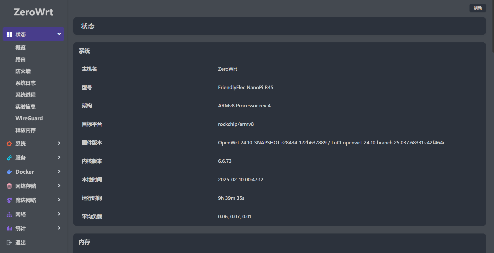

# 欢迎来到 ZeroWrt

I18N: [English](README_EN.md) | [简体中文](README.md) |

## 支持设备 

| [Rockchip](https://github.com/oppen321/OpenWrt-Action/releases) | [MediaTek](https://github.com/oppen321/OpenWrt-Action/releases) | [X86_64](https://github.com/oppen321/OpenWrt-Action/releases) | [Qualcomm](https://github.com/oppen321/OpenWrt-Action/releases) | 

## 官方讨论群

如有技术问题需要讨论或者交流，欢迎加入以下群：

1. QQ 讨论群：路由器交流群，号码 579896728，加群链接：[点击加入](https://qm.qq.com/q/oe4EAtvPIO "路由器交流群")
2. TG 讨论群：路由器交流群，加群链接：[点击加入](https://t.me/kejizero "路由器交流群")

## 固件说明
- 基于原生 OpenWrt 24.10 编译，默认管理地址 10.0.0.1   默认密码：password
- 默认开启“师夷长技以制夷”/Open克拉斯-SmartDNS-AdguardHome无需任何设置即可体验完美国内外分流,可以登录终端输入ZeroWrt弹出ZeroWrt选项菜单输入 6 一键设置切换SmartDNS或者MosDNS
- 切换Uhttpd为Nignx
- 内置ZeroWrt选项菜单方便用户设置OpenWrt
- 默认打开了wan口防火墙
- 默认所有网口可访问网页终端
- 默认设置所有网口可连接 SSH
- 默认已经切换了docker源，国内网络即可拉取镜像
- Rockchip切换ImmortalWrt Uboot 以及 Target支持更多的设备
- R2C/R2S 核心频率 1.6（交换了 LAN WAN），R4S 核心频率 2.2/1.8
- 插件包含：师夷长技以制夷，Open克拉斯，Adguardhome，Homeproxy，Mosdns，Lucky，动态DNS，FRP客户端，Mihomo Tproxy，Samba4，SmartDNS，Dockerman，Alist，USB打印机服务，Webdav，应用过滤，Socat

---

## 本地编译环境安装（根据 Ubuntu24.04）

构建 OpenWrt 24.10 最新 ZeroWrt
### x86_64
   ```shell
   curl -sS -O https://git.kejizero.online/zhao/files/raw/branch/main/x86.sh && chmod +x x86.sh && ./x86.sh
   ```
### Rockchip
   ```shell
   curl -sS -O https://git.kejizero.online/zhao/files/raw/branch/main/Rockchip.sh && chmod +x Rockchip.sh && ./Rockchip.sh
   ```
### IPQ807x
   ```shell
   curl -sS -O https://git.kejizero.online/zhao/files/raw/branch/main/IPQ807x.sh && chmod +x IPQ807x.sh && ./IPQ807x.sh
   ```

---

## ZeroWrt选项菜单
 
 
- ZeroWrt选项菜单是一个方便用户配置OpenWrt
- 默认连接SSH连接或者终端输入ZeroWrt弹出ZeroWrt选项菜单
- 目前脚本支持一键更换LAN口ip、一键设置默认主题、一键修改密码、恢复出厂设置、一键部署 、IPv6 开关 (仅适用于主路由)、iStoreOS风格化和检测更新

---

## Mediatek_filogic-Uboot设置（请使用本仓库Mediatek_filogic_hanwckf固件）
1. 根据 hanwckf 的源码编译：| [bl-mt798x](https://github.com/hanwckf/bl-mt798x) |编译的mt798x-uboot，并对其进行了汉化
2. 前往这里下载对应设备的uboot | [U-Boot-mt798x](https://github.com/oppen321/ZeroWrt/releases/tag/U-Boot-mt798x) |
3. winscp进入路由器tmp文件夹，上传uboot：mt7981_cetron_ct3003-fip-fixed-parts.bin（这里替换成你设备相对应的 uboot）
4. 逐条运行以下命令刷入大分区uboot

   ```bash
   cd /tmp
   md5sum mt7981_cetron_ct3003-fip-fixed-parts.bin
   mtd write mt7981_cetron_ct3003-fip-fixed-parts.bin FIP
   mtd verify mt7981_cetron_ct3003-fip-fixed-parts.bin FIP
   ```


---

## Arm Docker项目
默认地址：10.0.0.1 默认用户：root 默认密码：password

## 使用方法
1、创建 macvlan 网络
```bash
docker network create -d macvlan --subnet=192.168.xx.0/24 --gateway=192.168.xx.yy -o parent=eth0 macnet
```

如果正在使用的不是 eth0 接口，请将其更改为正在使用的接口，若网络是桥接模式请使用下方命令创建

```bash
docker network create -d macvlan --subnet=192.168.xx.0/24 --gateway=192.168.xx.yy -o parent=br-lan macnet
```
注意：macnet 为名称，macvlan 为模式，将 IP 更改为主路由网段与 IP 地址

2、拉取镜像并创建容器
```bash
docker run -d --name=openwrt --network=macnet --privileged=true --restart=always --ulimit nofile=16384:65536 -v /lib/modules/$(uname -r):/lib/modules/$(uname -r) zhaoweiwen123/openwrt-aarch64:plus
```

如需使用 Mini稳定版 固件，将后面的 plus 更改为 mini 即可

3、更改固件默认 IP 地址

```bash
docker exec openwrt sed -e 's/192.168.1.1/192.168.xx.zz/' -i /etc/config/network
```

容器创建成功后稍等几分钟执行命令，将 IP 更改为与主路由同一网段的 IP 地址，更改完成后重启容器生效
```bash
docker restart openwrt
```
好了部署完成，接下来登录更改后的 IP 地址进行其他设置吧

---

## 定制固件 [](#定制固件-)
1. 首先要登录 Gihub 账号，然后 Fork 此项目到你自己的 Github 仓库
2. 修改 `configs` 目录对应文件添加或删除插件，或者上传自己的 `xx.config` 配置文件
3. 插件对应名称及功能请参考恩山网友帖子：[Applications 添加插件应用说明](https://www.right.com.cn/forum/thread-3682029-1-1.html)
4. 如需修改默认 IP、添加或删除插件包以及一些其他设置请在 `diy-script.sh` 文件内修改
5. 添加或修改 `xx.yml` 文件，最后点击 `Actions` 运行要编译的 `workflow` 即可开始编译
6. 编译大概需要2-3小时，编译完成后在仓库主页 [Releases](https://github.com/oppen321/ZeroWrt/releases) 对应 Tag 标签内下载固件
<details>
<summary><b>&nbsp;如果你觉得修改 config 文件麻烦，那么你可以点击此处尝试本地提取</b></summary>

1. 首先装好 Linux 系统，推荐 Debian 11 或 Ubuntu LTS

2. 安装编译依赖环境

   ```bash
   sudo apt update -y
   sudo apt full-upgrade -y
   sudo apt install -y ack antlr3 asciidoc autoconf automake autopoint binutils bison build-essential \
   bzip2 ccache clang cmake cpio curl device-tree-compiler flex gawk gcc-multilib g++-multilib gettext \
   genisoimage git gperf haveged help2man intltool libc6-dev-i386 libelf-dev libfuse-dev libglib2.0-dev \
   libgmp3-dev libltdl-dev libmpc-dev libmpfr-dev libncurses5-dev libncursesw5-dev libpython3-dev \
   libreadline-dev libssl-dev libtool llvm lrzsz msmtp ninja-build p7zip p7zip-full patch pkgconf \
   python3 python3-pyelftools python3-setuptools qemu-utils rsync scons squashfs-tools subversion \
   swig texinfo uglifyjs upx-ucl unzip vim wget xmlto xxd zlib1g-dev
   ```

3. 下载源代码，更新 feeds 并安装到本地

   ```bash
   git clone https://git.openwrt.org/openwrt/openwrt.git
   cd openwrt
   ./scripts/feeds update -a
   ./scripts/feeds install -a
   ```

4. 复制 diy-script.sh 文件内所有内容到命令行，添加自定义插件和自定义设置

5. 命令行输入 `make menuconfig` 选择配置，选好配置后导出差异部分到 seed.config 文件

   ```bash
   make defconfig
   ./scripts/diffconfig.sh > seed.config
   ```

7. 命令行输入 `cat seed.config` 查看这个文件，也可以用文本编辑器打开

8. 复制 seed.config 文件内所有内容到 configs 目录对应文件中覆盖就可以了

   **如果看不懂编译界面可以参考 YouTube 视频：[软路由固件 OpenWrt 编译界面设置](https://www.youtube.com/watch?v=jEE_J6-4E3Y&list=WL&index=7)**
</details>

---

## 问题反馈

如果在使用过程中遇到任何问题，欢迎：
1. [提交 Issue](https://github.com/oppen321/ZeroWrt/issues)
2. [加入讨论](https://github.com/oppen321/ZeroWrt/discussions)

---

## 特别感谢

<table>
<tr>
<td width="200"><a href="https://www.friendlyarm.com" target="_blank">友善电子科技</a></td>
<td width="200"><a href="https://github.com/openwrt/openwrt" target="_blank">OpenWrt</a></td>
<td width="200"><a href="https://github.com/immortalwrt/immortalwrt" target="_blank">ImmortalWrt</a></td>
</tr>
<tr>
<td width="200"><a href="https://github.com/jerrykuku" target="_blank">jerrykuku</a></td>
<td width="200"><a href="https://github.com/QiuSimons" target="_blank">QiuSimons</a></td>
<td width="200"><a href="https://github.com/xiaorouji" target="_blank">xiaorouji</a></td>
</tr>
<tr>
<td width="200"><a href="https://github.com/IrineSistiana" target="_blank">IrineSistiana</a></td>
<td width="200"><a href="https://github.com/sirpdboy" target="_blank">sirpdboy</a></td>
<td width="200"><a href="https://github.com/fw876" target="_blank">fw876</a></td>
</tr>
</table>

---
