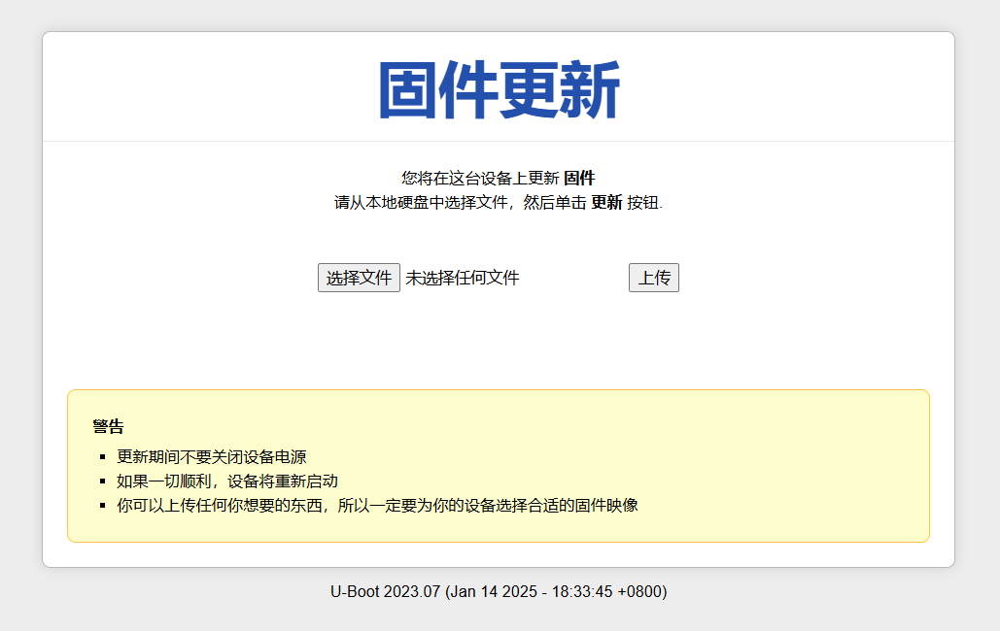

# Welcome to ZeroWrt

I18N: [English](README_EN.md) | [简体中文](README.md) |

## Support devices 
| [Rockchip](https://github.com/oppen321/OpenWrt-Action/releases) | [MediaTek](https://github.com/oppen321/OpenWrt-Action/releases) | [X86_64](https://github.com/oppen321/OpenWrt-Action/releases) | [Qualcomm](https://github.com/oppen321/OpenWrt-Action/releases) |

## Official discussion group

If you have any technical issues that you need to discuss or communicate with, you are welcome to join the following groups：

1. QQ discussion group：Router exchange group，Number 579896728，Add group link：[Click to join](https://qm.qq.com/q/oe4EAtvPIO "Router exchange group")
2. TG discussion group：Router exchange group，Add group link：[Click to join](https://t.me/kejizero "Router exchange group")

## Firmware instructions
- Compiled based on native OpenWrt 24.10, default management address 10.0.0.1 Default password: password
- Switch Uhttpd to Nginx
- The built-in ZeroWrt option menu facilitates users to set OprnWrt
- The wan port firewall is turned on by default
- By default, all network ports can access the web terminal
- By default, all network ports can connect to SSH
- The docker source has been switched by default, and the image can be pulled from the domestic network
- Rockchip switches ImmortalWrt Uboot and Target to support more devices
- R2C/R2S core frequency 1.6 (LAN WAN swapped), R4S core frequency 2.2/1.8
- Plugins included: PassWall, OpenClash, Adguardhome, Homeproxy, Mosdns, Lucky, Dynamic DNS, FRP Client, Mihomo Tproxy, Samba4, SmartDNS, Dockerman, Alist, USB Printer Service, Webdav, Application Filtering, Socat

## ZeroWrt options menu
 
- The ZeroWrt options menu is a convenient way for users to configure OpenWrt
- The default connection is SSH connection or the terminal enters ZeroWrt to pop up the ZeroWrt option menu
- Currently, the script supports one-click replacement of LAN port IP, one-click setting of default theme, one-click password modification, one-click restoration of factory settings, one-click deployment, IPv6 switch (only applicable to main router), iStoreOS stylization and detection of updates

## Mediatek_filogic-Uboot settings
1. Compile based on the source code of hanwckf：| [bl-mt798x](https://github.com/hanwckf/bl-mt798x) |Compiled mt798x-uboot and Chineseized it
2. Go here to download uboot for the corresponding device | [U-Boot-mt798x](https://github.com/oppen321/ZeroWrt/releases/tag/U-Boot-mt798x) |
3. winscp enter the router tmp folder and upload uboot：mt7981_cetron_ct3003-fip-fixed-parts.bin（Replace here with the one corresponding to your device uboot）
4. Run the following commands one by one to flash the large partition uboot

   ```bash
   cd /tmp
   md5sum mt7981_cetron_ct3003-fip-fixed-parts.bin
   mtd write mt7981_cetron_ct3003-fip-fixed-parts.bin FIP
   mtd verify mt7981_cetron_ct3003-fip-fixed-parts.bin FIP
   ```


- ## Custom firmware [](#Custom firmware-)
1. First log in to your Gihub account, then Fork this project to your own Github repository
2. Modify the corresponding files in the `configs` directory to add or delete plug-ins, or upload your own `xx.config` configuration file
3. For the corresponding name and function of the plug-in, please refer to Enshan netizen’s post：[Applications Add plug-in application description](https://www.right.com.cn/forum/thread-3682029-1-1.html)
4. If you need to modify the default IP、To add or remove plug-in packages and some other settings, please `diy-script.sh` Modify within the file
5. Add or modify `xx.yml` document，last click `Actions` Run the `workflow` to be compiled to start compilation
6. Compilation takes about 2-3 hours. After the compilation is completed, download the firmware in the corresponding Tag tag on the warehouse homepage [Releases](https://github.com/oppen321/ZeroWrt/releases)
<details>
<summary><b>&nbsp;If you find it troublesome to modify the config file, you can click here to try local extraction</b></summary>

1. First install the Linux system, Debian 11 or Ubuntu LTS is recommended

2. Install the compilation dependency environment

   ```bash
   sudo apt update -y
   sudo apt full-upgrade -y
   sudo apt install -y ack antlr3 asciidoc autoconf automake autopoint binutils bison build-essential \
   bzip2 ccache clang cmake cpio curl device-tree-compiler flex gawk gcc-multilib g++-multilib gettext \
   genisoimage git gperf haveged help2man intltool libc6-dev-i386 libelf-dev libfuse-dev libglib2.0-dev \
   libgmp3-dev libltdl-dev libmpc-dev libmpfr-dev libncurses5-dev libncursesw5-dev libpython3-dev \
   libreadline-dev libssl-dev libtool llvm lrzsz msmtp ninja-build p7zip p7zip-full patch pkgconf \
   python3 python3-pyelftools python3-setuptools qemu-utils rsync scons squashfs-tools subversion \
   swig texinfo uglifyjs upx-ucl unzip vim wget xmlto xxd zlib1g-dev
   ```

3. Download source code, update feeds and install locally

   ```bash
   git clone https://git.openwrt.org/openwrt/openwrt.git
   cd openwrt
   ./scripts/feeds update -a
   ./scripts/feeds install -a
   ```

4. Copy all the contents of the diy-script.sh file to the command line, add custom plug-ins and custom settings

5. Enter `make menuconfig` on the command line to select the configuration. After selecting the configuration, export the differences to the seed.config file

   ```bash
   make defconfig
   ./scripts/diffconfig.sh > seed.config
   ```

7. Enter `cat seed.config` on the command line to view this file, or you can open it with a text editor

8. Copy all the contents in the seed.config file to the corresponding file in the configs directory and overwrite it

   **If you don’t understand the compilation interface, you can refer to the YouTube video：[Soft routing firmware OpenWrt compilation interface settings](https://www.youtube.com/watch?v=jEE_J6-4E3Y&list=WL&index=7)**
</details>

## Problem feedback

If you encounter any problems during use, please feel free to:
1. [Submit Issue](https://github.com/oppen321/ZeroWrt/issues)
2. [Join the discussion](https://github.com/oppen321/ZeroWrt/discussions)

## Special thanks

<table>
<tr>
<td width="200"><a href="https://www.friendlyarm.com" target="_blank">友善电子科技</a></td>
<td width="200"><a href="https://github.com/openwrt/openwrt" target="_blank">OpenWrt</a></td>
<td width="200"><a href="https://github.com/immortalwrt/immortalwrt" target="_blank">ImmortalWrt</a></td>
</tr>
<tr>
<td width="200"><a href="https://github.com/jerrykuku" target="_blank">jerrykuku</a></td>
<td width="200"><a href="https://github.com/QiuSimons" target="_blank">QiuSimons</a></td>
<td width="200"><a href="https://github.com/xiaorouji" target="_blank">xiaorouji</a></td>
</tr>
<tr>
<td width="200"><a href="https://github.com/IrineSistiana" target="_blank">IrineSistiana</a></td>
<td width="200"><a href="https://github.com/sirpdboy" target="_blank">sirpdboy</a></td>
<td width="200"><a href="https://github.com/fw876" target="_blank">fw876</a></td>
</tr>
</table>
